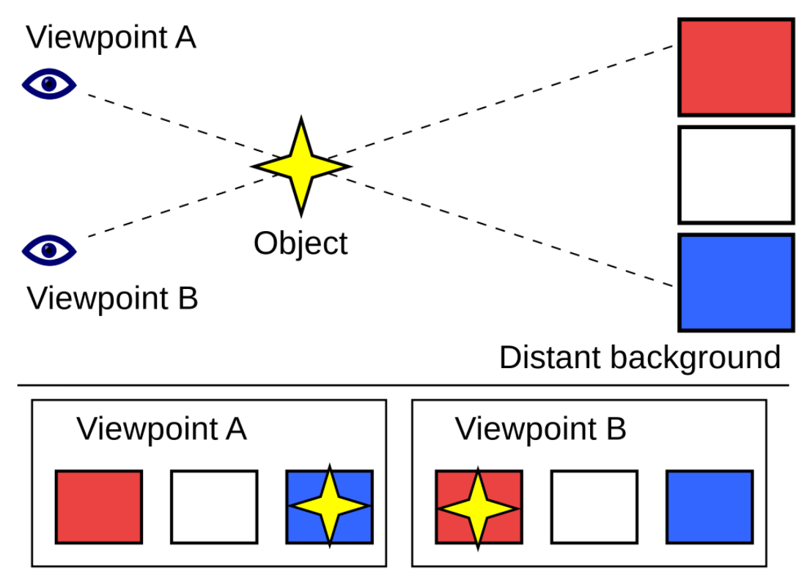
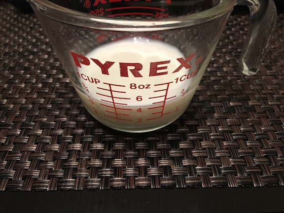
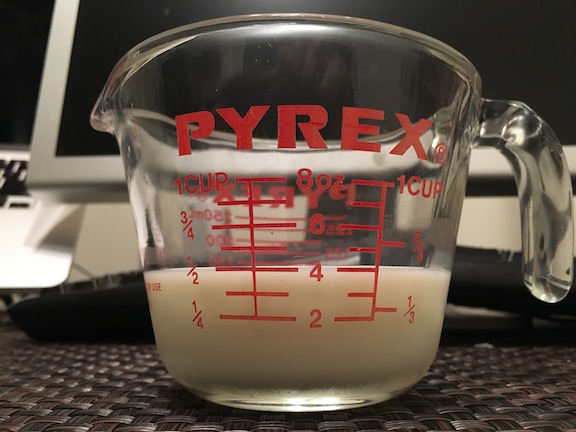

# A Primer on Parallax
## What is parallax?
In the website design world, parallax-scrolling is a technique used to add a sense of depth and motion to web pages as the user scrolls downward, or up for that matter, along the page. This adds some sugar and spice to what could otherwise be a flat static web page. Now, while the technique is several years, it is still a part of modern front-end web design and creates a great effect when used wisely. 

Parallax itself is a term used to describe the apparent displacement of an object when viewed from different positions (usually involving different angles). In fact because objects that are closer to us have a larger apparent displacement than more distant objects we can determine distances. Parallax is calculated based on the angle of inclination, which I would describe as the angle between the observer and the object, and the normal line that describes the shortest distance to the line or plane that the observer may move along. 

  </img>

__Fig. 1. Parallax diagram__**

Likely, one of the better examples I can recall is accurately reading a beaker from chemistry class. Here, if your eye is above or below the plane that the top of the liquid you are measuring sits on, your measurement will be off. See these examples when looking at milk in a measuring cup. 

  </img>
  </img>

__Fig 2. On the left it appears we have more than 1/2 a cup because we are looking at an angle from above. When the camera (or your eye) is in the same plane as the top layer of the milk, you can see we actually have 1/2 a cup.__**

When taken in conjunction with motion, a great example is when you look out of the window of a moving car. A fence nearest the car will appear to be moving by much quicker than the trees or homes behind the fence, which in turn will seem to move more quickly than say the mountains in the background.

To achieve a greater sense of motion in the early days of animation, this process was done in reverse. You would have the subject in the middle of the screen, while you move the background. Later animators started using multiple backgrounds moving at different speeds to produce a more realistic effect. 

In the late 1930's, Disney took this to an extreme level with their seven-layered multi-planed camera. For you budding developers in the San Francisco Bay Area, you can see this at the Walt Disney museum in the Presidio, along with an explanation of how it works. If you are outside of the Bay Area, you can watch Disney himself explain it here 

One of the most important take-aways from the explanation of how it works is that the scenes are broken up by distance onto different planes by painting the scenes onto different pieces of glass. The background (in Disney's example, the background contains the moon), does not move. To make a 3D effect the pieces of glass can be moved forward or backward. Thus, the moon will stay the same size, where as the elements that are on the closest piece of glass will change size more rapidly.

For side to side motion, animators could let the background remain stationary or move very little, while closer elements on different planes moved at different rates from side to side. These techniques stood the test of time, and were later moved to video games in the early 1980's. One of the first 2D video games to use parallax to make a 3D effect was Jungle King/Jungle Hunt from Taito. A game where the explorer Sir Dudley races to save Lady Penelope in the dangerous jungle. Of course Super Mario Brothers games use parallax scrolling, and the technique still thrives today in Unity 2D game development. If you want to see how archaic games were back then, check out the Atari 2600 version of the game:

##Parallax-scrolling for websites
For the web, in the most simple sense, I would describe parallax scrolling as the appearance of motion caused by a faster moving foreground element as compared to a slower moving element between the foreground and the background. However, what I call 'parallax-like' (one group of elements move while others remain on a static background) is still a cool effect. 

Here is one of my favorite pages that uses that effect. It's a Brazilian Jiu Jitsu school homepage. I like it because it's clean, and I also happen to know some of the people in the pictures ;) 

http://www.studio540.com/

Importantly, besides being really clean, I like the responsiveness and how the parallax-like effect is used to effectively go through all of the parts of what a typical martial arts webpage would want to display: 1) a splash page, 2) the instruction team, 3) the class schedule, 4) facility photos, 5) photos of the team training, 6) contact information all on a single page. The skilled designer manages to draw you through the entire site. Which brings me to... 

##When to use a parallax-type scrolling page
Here are some examples of when you want to use a parallax effect:
1. When have a long single-page to navigate through
1. When you want to tell as story
1. When you want to display the best examples of what you have to sell
1. When you have a few pages that surround a single theme (like the martial arts school case, a small business with a single focus, or a service such as a law or medical office).
1. Portfolio pages - showcase some of your best work if you are an artist or designer

Some of examples when not to use it:
1. A site designed to display a lot of information, like a state government site
1. For an e-commerce site. Could you imagine everything on eBay on one page?
1. A site for a large business organization

However, by using the techniques correctly and when warranted, you can highlight key points of your presentation. Or perhaps just through in little extras that you want the user to pay attention to. 

##Some award winning extreme examples
You can find sites that catalog some of the best of the best websites that use a certain technology. By checking some out, I found a couple of examples of parallax sites that won some awards. The first however actually isn't a parallax site (or at leat I don't consider it a true parallax site), again because it is using fixed backgrounds and a moving foreground. Nonetheless, it's pretty cool:
http://porschevolution.com/#

The next example is really over the top:
http://www.sbs.com.au/theboat/

##Methods and Concerns
Well, here's the deal. There are various methods to accomplish these effects. We have already discussed using a fixed background and a moving foreground for a parallax-like scrolling effect. For true parallax sites, there are many methods available to provide animation. 

Raster: 
Layering:
Pattern: 
Sprite: 

There are several concerns when using parallax on your web designs. For the sake of this transcript, I personally was looking to learn a little more about CSS, so the first concern that matches up is that many of the techniques require JavaScript and many write websites with additional libraries or frameworks such as JQuery. This is fine for many browsers, but as we move towards mobile development and notepad devices, extra care must be taken when using JavaScript. 

Other's note difficulties in SEO, stating that with a single page, you only have one set of metadata, and your semantic HTML is limited. However, one of the main detractors from using JavaScript in some of the methods is performance issues. I noticed myself when writing this primer, that the Porsche website example above sometimes runs into problems when I view the site in Chrome. Which now brings us to:

##Parallax scrolling effects with just CSS
By just using CSS, a lot of speed and bug performance issues can be alleviated. Moreover, at least for now, we can learn a little more about CSS. First, let's just start off with something simple... using the "position" properties to make one image scroll while keeping the other stationary.
