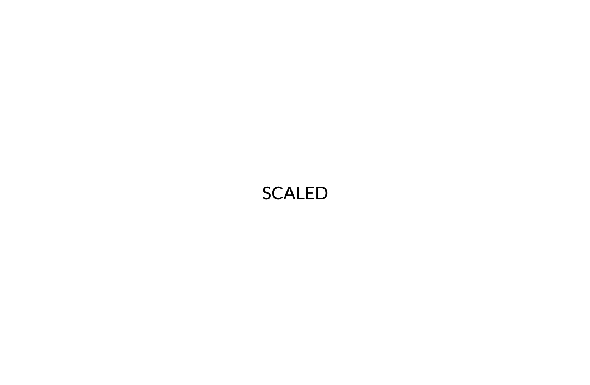

# A Primer on Parallax
## What is parallax?
In the website design world, parallax-scrolling is a technique used to add a sense of depth and motion to web pages as the user scrolls downward, or up for that matter, along the page. This adds some sugar and spice to what could otherwise be a flat static web page. Now, while the technique is several years, it is still a part of modern front-end web design and creates a great effect when used wisely.

Parallax itself is a term used to describe the apparent displacement of an object when viewed from different positions (usually involving different angles). In fact because objects that are closer to us have a larger apparent displacement than more distant objects we can determine distances. Parallax is calculated based on the angle of inclination, which I would describe as the angle between the observer and the object, and the normal line that describes the shortest distance to the line or plane that the observer may move along.

<p align="center">
  </img>
</p>
**_Fig. 1. Parallax diagram_**

Likely, one of the better examples I can recall is accurately reading a beaker from chemistry class. Here, if your eye is above or below the plane that the top of the liquid you are measuring sits on, your measurement will be off. See these examples I just made when looking at milk in a measuring cup.

<p align="center">
  </img>
  </img>
</p>
**_Fig 2. On the left it appears we have more than 1/2 a cup because we are looking at an angle from above. When the camera (or your eye) is in the same plane as the top layer of the milk, you can see we actually have 1/2 a cup._**

When taken in conjunction with motion, a great example is when you look out of the window of a moving car. A fence nearest the car will appear to be moving by much quicker than the trees or homes behind the fence, which in turn will seem to move more quickly than say the mountains in the background.

To achieve a greater sense of motion in the early days of animation, this process was done in reverse. You would have the subject in the middle of the screen, while you move the background. Later animators started using multiple backgrounds moving at different speeds to produce a more realistic effect.

In the late 1930's, Disney took this to an extreme level with their seven-layered multi-planed camera. For you budding developers in the San Francisco Bay Area, you can see this at the Walt Disney museum in the Presidio, along with an explanation of how it works. If you are outside of the Bay Area, you can watch Disney himself explain it here:

[](https://www.youtube.com/watch?v=YdHTlUGN1zw)

**_Fig. 3. See Walt Disney explain how the multi-planed camera allowed 3D-like animation using parallax._**

One of the most important take-aways from the explanation of how it works is that the scenes are broken up by distance onto different planes by painting the scenes onto different pieces of glass. The background (in Disney's example, the background contains the moon), does not move. To make a 3D effect the pieces of glass can be moved forward or backward. Thus, the moon will stay the same size, where as the elements that are on the closest piece of glass will change size more rapidly.

For side to side motion, animators could let the background remain stationary or move very little, while closer elements on different planes moved at different rates from side to side. These techniques stood the test of time, and were later moved to video games in the early 1980's. One of the first 2D video games to use parallax to make a 3D effect was Jungle King/Jungle Hunt from Taito. A game where the explorer Sir Dudley races to save Lady Penelope in the dangerous jungle. Of course Super Mario Brothers games use parallax scrolling, and the technique still thrives today in Unity 2D game development. If you want to see how archaic games were back then, check out the Atari 2600 version of the game:

[](https://www.youtube.com/watch?v=flYEqNNSWGs)

**_Fig. 4. In the 1980s parallax effects were used to give a better sense of motion in video games._**

##Parallax-scrolling for websites
For the web, in the most simple sense, I would describe parallax scrolling as the appearance of motion caused by a faster moving foreground element as compared to a slower moving element between the foreground and the background. However, what I call 'parallax-like' (one group of elements move while others remain on a static background) is still a cool effect.

Here is one of my favorite pages that uses that effect. It's a Brazilian Jiu Jitsu school homepage. I like it because it's clean, and I also happen to know some of the people in the pictures ;)

<p align="center">
<a href="http://www.studio540.com/"></img></a>
</p>
**_Fig. 5. This website uses a nice scrolling effect to get what would normally be several different pages onto a single page. They basically entice the user to scroll through all of the sections. Click on the image to see it live._**

Importantly, besides being really clean, I like the responsiveness and how the parallax-like effect is used to effectively go through all of the parts of what a typical martial arts webpage would want to display: 1) a splash page, 2) the instruction team, 3) the class schedule, 4) facility photos, 5) photos of the team training, 6) contact information all on a single page. The skilled designer manages to draw you through the entire site. Which brings me to...

##When to use a parallax-type scrolling page
Here are some examples of when you want to use a parallax effect:

1. When have a long single-page to navigate through
1. When you want to tell as story
1. When you want to display the best examples of what you have to sell
1. When you have a few pages that surround a single theme (like the martial arts school case, a small business with a single focus, or a service such as a law or medical office).
1. Portfolio pages - showcase some of your best work if you are an artist or designer

Some of examples when not to use it:

1. A site designed to display a lot of information, like a state government site
1. For an e-commerce site. Could you imagine everything on eBay on one page?
1. A site for a large business organization

However, by using the techniques correctly and when warranted, you can highlight key points of your presentation. Or perhaps just through in little extras that you want the user to pay attention to.

##Some award winning extreme examples
You can find sites that catalog some of the best of the best websites that use a certain technology. By checking some out, I found a couple of examples of parallax sites that won some awards. The first however actually isn't a parallax site (or at leat I don't consider it a true parallax site), again because it is using fixed backgrounds and a moving foreground. Nonetheless, it's pretty cool:

<p align="center">
<a href="http://porschevolution.com/#"></img></a>
</p>
**_Fig. 6. This website is really cool, again using a nice scrolling effect._**


The next example is a masterpiece. It tells a story and is animated throughout. You can tell why this one won an award:

<p align="center">
<a href="http://www.sbs.com.au/theboat/"></img></a>
</p>
**_Fig. 7. This website uses parallax to achieve motion and depth, and is totally over the top._**


##Methods and Concerns
Well, here's the deal. There are various methods to accomplish these effects. We have already discussed using a fixed background and a moving foreground for a parallax-like scrolling effect. For true parallax sites, there are various methods available to provide animation, however they may rely on constantly redrawing or rasterizing images, using complex patterns or sprites. 

There are several concerns when using parallax on your web designs, and a big one is performance. For the sake of this transcript, I personally was looking to learn a little more about CSS, so the first concern that matches up is that many of the techniques do require JavaScript, and many write websites with additional libraries or frameworks such as JQuery. This may be fine for the most modern browsers, but for older browsers as well as mobile and notepad devices, extra care must be taken when using JavaScript. Other's note difficulties in SEO, stating that with a single page, you only have one set of metadata, and your semantic HTML is limited. 

Going back to one of the main detractors - performance issues - I noticed myself when trying to select parallax websites that many suffered performance issues or had glitches. In fact, the Porsche website example above randomly runs into problems when I view the site in the latest version of Chrome. Which now brings us to:

##Parallax scrolling effects with just CSS
By just using CSS, a lot of speed and bug performance issues can be alleviated. Moreover, at least for now, we can learn a little more about CSS. First, let's just start off with something simple... using the "position" properties to make one image scroll while keeping the other stationary.

The main part of the HTML code is pretty simple, we have a couple of images that are put into divs so we can change their properties. The full code is in the repo under [part1.html](https://datadaveshin.github.io/parallax/part1.html) and part1.css. But for illustrations sake, the main parts are here and you can see the results (for this page and the following) by simply clicking on the names of the files because they are linked:

```HTML
    <!-- Adjust to middle of page -->
    <div class="spacer">

    <!-- The Pear -->
    <div class="pear-background-container">
      
    </div>

    <!-- The first Pickle -->
    <div class="pickle-foreground-container">
      
    </div>

    <!-- The second Pickle -->
    <div class="pickle-foreground-container2">
      
    </div>

    </div>
```

Next, we do a couple of things with the CSS. The first is, just to allow us to 'scroll', I changed the height of the body to a large number of pixels, 2400. That way, we have plenty of "scroll room". Now, depending if you are a [Pear or a Pickle](https://datadaveshin.github.io/pickles-vs-pears/), the container class you have will either be background or foreground. Moreover, your position property will either be 'fixed' or 'relative'.

 ```CSS
 /* Give us a scroll bar and a page with enough "scroll" to it*/
 body {
   min-height: 2400px;
 }

 /*----- Bring things to the middle -----*/
 .spacer {
   margin: 0 25% 0 25%;
 }

 /*----- Containers ------*/
 .pear-background-container {
   position: fixed;
   top: 150px;
   /*border: 1px solid cyan;*/
 }

 .pickle-foreground-container {
   position: relative;
   top: 150px;
   /*border: 1px solid red;*/
 }

 .pickle-foreground-container2 {
   position: relative;
   top: 800px;
   left: 220px;
   /*border: 1px solid lime;*/
 }

 /*----- Images -----*/
 .pear-background-container img {
   border-radius: 50%;
   /*border: 1px solid blue;*/
 }

 .pickle-foreground-container img {
   border-radius: 50%;
   /*border: 1px solid pink;*/
 }

 .pickle-foreground-container2 img {
   border-radius: 50%;
   /*border: 1px solid green;*/
 }
```

If you are a newbie, or hazy on what these property values mean, you can check them out here at [MDN](https://developer.mozilla.org/en-US/docs/Web/CSS/position), but basically, the element can have values for their 'top', 'right', 'bottom', 'left' in pixels, but those take on different meaning depending what the value of the 'position' property means. The value 'fixed' means that those directional displacements are relative to the screen's viewport, whereas for the 'relative' property - the elements are placed within the flow of the page, and then the position is adjusted. That said, these elements then will of course move when scrolling.

Anyway, try it out. You will see that upon scolling, the pickle will reveal that he was covering a pear. As you continue to scroll, you can see how this occured as another pickle will come up beside the pear. Basically, the pickle masked the pear from view. 

Now, I think it is important to stop right here and play with this system. Try changing the position values around. Switch them between 'static', 'fixed', 'relative', 'absolute'. To help you visualize, use [part1b.html](https://datadaveshin.github.io/parallax/part1b.html) that calls part1b.css - here the border's are now uncommented (you can also uncomment them yourself, in the part1.css file. These borders will help you visualize what happens when you change the position property. 

However, to get on track. This is a basic way to set up scrolling effects for your website.

##Actual Parallax
While there are a few ways to make scrolling effects with CSS, likely the most interesting is using parallax to make parallax. That's right, we are going to go 3D in order to make a 3D effect. So as far as I can tell, the technique we will be focusing on today was either fully or partially (or independently) developed by Keith Clark.  

Again, the code is provided in the files as [part2.html](https://datadaveshin.github.io/parallax/part2.html) and part2.css, while some of the important parts are displayed below:

```HTML
    <div class="parallax">

      <!-- Pear -->
      <div class="parallax_layer parallax_layer-front">
        <div class="spacer-pear">
          
        </div>
      </div>

      <!-- Pickle -->
      <div class="parallax_layer parallax_layer-back">
        <div class="spacer-pickle">
          
        </div>
      </div>

    </div>
 ```

 ```CSS
/*----- For Parallax ----- */
.parallax {
  height: 100vh;
  overflow-x: hidden;
  overflow-y: auto;
  -webkit-perspective: 1px;
  perspective: 1px;
}

.parallax_layer {
  position: absolute;
  top: 0;
  left: 0;
  right: 0;
  bottom: 0;
}

.parallax_layer-front {
  -webkit-transform: translateZ(0);
  transform: translateZ(0);
}

.parallax_layer-back {
  -webkit-transform: translateZ(-1px) scale(2);
  transform: translateZ(-1px) scale(2);
}

```

Now when you scroll the pear out paces the pickle!!!

So, what is happening here. Well, what Keith did was take into account that the browser actually can work in 3D. Here he uses the [perspective](https://developer.mozilla.org/en-US/docs/Web/CSS/perspective) CSS property in the 'parallax' class. The values for this property set the displacement from the z = 0 plane and the viewer. The real magic comes from the [transform](https://developer.mozilla.org/en-US/docs/Web/CSS/transform) property - this allows you to alter rotation and translation, as well as skewness and scale in 3D coordinate space. By giving the value of -1 to the "back" layer that holds the pickle, the pickle will move slower... why? Think about Walt Disney and the video (which I hope you watched above). This is the same principle as the first example he gave in the video with the moon. While there is no fixed 'moon' in this example, the pickle represents say a character on one of the lower level planes of the multi-plane camera platform. The pear is one of the close ones. If we swap out the pickle and the pear with the same rectangular image, representative of one of Disney's planes, things might be more clear... so check out [part3.html](https://datadaveshin.github.io/parallax/part3.html). 

In [part3.html](https://datadaveshin.github.io/parallax/part3.html) Here you will see one of my favorite spots that is south of San Francisco. The two images are the same size. They are the same image:

<p align="center">
<a href="https://datadaveshin.github.io/parallax/part3.html"></img></a>
</p>
**_Fig. 8. The arrangment of these images is reminiscent of Disney's multi-plane camera set-up._**

However, one is smaller than the other. It is because it is further away from our viewpont... the `transform: translateZ(-1px)`. Just to be clear, the larger (transparent) image is in front of the smaller one, for proof, let's look at it fully opaque [part3b.html](https://datadaveshin.github.io/parallax/part3b.html), or perhaps it may be clearer with text [part3c.html](https://datadaveshin.github.io/parallax/part3c.html). 

Now, you may ask, why was the pickle the same size as the pear??? Well, there is one other part that was in that particular example that was not included in the ones that followed. Keith uses 'tranform' again, but with scaling using the 'scale' function. So basically, the back image is further away, so we must increase it's size. The calculation to set the scale is `1 + (translateZ * -1) / perspective`, so in this case: 1 + (-1 * -1) / 1 = 2. Using this formula, you can set the relative speeds of your elements.

So here we have now applied the scale factor and you can see in [part4.html](https://datadaveshin.github.io/parallax/part4.html) that the words are now the same size. Well, maybe that isn't the easiest to see, how about if the words said the same thing... [part4b.html](https://datadaveshin.github.io/parallax/part4b.html)

<p align="center">
<a href="https://datadaveshin.github.io/parallax/part4b.html"></img></a>
</p>
**_Fig. 9. There are two words here, but they appear as one because the scale factor is layed out correctly._**

Now, of course, as I was trying to make my own full-blown fancy version of a web-site I started running into problems. After the typical frustration, and continuing writing this up... I of course stumbled across a youtube video from Thomas Bradley that nicely goes over what has been discussed, and a few little extra tricks to put your page together using this technique. 

[](https://www.youtube.com/watch?v=n9zLJ0I8Djk)

**_Fig. 10. The CSS technique with a couple of little tweaks._**

Likely the most important is a formula to line up your images to the viewport. Here you would set the 'position' property of your moving div to 'relative', and give the 'top' property a value of `calc(((100vh - aspectRatio) / 4 * -2)`, but watch the video because he has a has a couple of other nice tricks. Other considerations can be found [here](http://keithclark.co.uk/articles/practical-css-parallax/). All in all, this was an interesting exploration of the CSS that goes into 3D transformations. 

_References for your enjoyment:_

- https://en.wikipedia.org/wiki/Multiplane_camera
- https://www.youtube.com/watch?v=YdHTlUGN1zw
- http://www.awwwards.com/20-best-websites-with-parallax-scrolling-of-2013.html
- http://www.awwwards.com/30-great-websites-with-parallax-scrolling.html
- http://www.creativebloq.com/web-design/parallax-scrolling-1131762
- http://www.wix.com/blog/2015/10/captivate-your-site-viewers-with-parallax-scrolling/
- http://www.vandelaydesign.com/parallax-scrolling-best-practices-examples-and-tutorials/
- https://envato.com/blog/parallax-scrolling-in-web-design/
- https://clickrain.com/blog/parallax-scrolling-examples-and-history
- https://envato.com/blog/parallax-scrolling-in-web-design/
- https://cyberchimps.com/parallax-web-design/
- http://keithclark.co.uk/articles/pure-css-parallax-websites/
- https://www.unleashed-technologies.com/blog/2013/08/15/what-parallax-web-design-%E2%80%93-definitions-tips-considerations
- https://www.youtube.com/watch?v=n9zLJ0I8Djk
- http://keithclark.co.uk/articles/practical-css-parallax/
- https://learn-the-web.algonquindesign.ca/topics/css-animations-effects/
- https://css-tricks.com/tour-performant-responsive-css-site/
